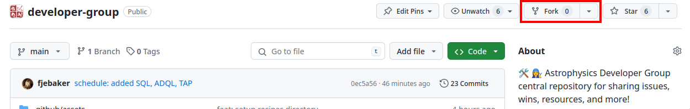
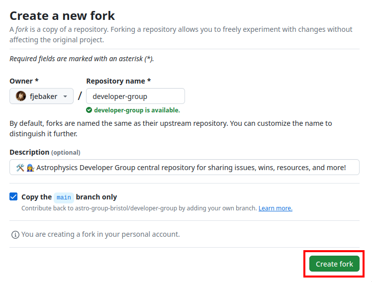
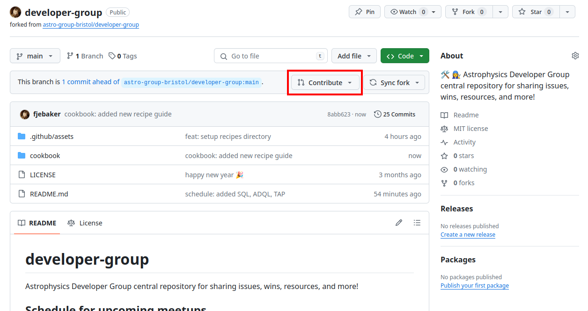
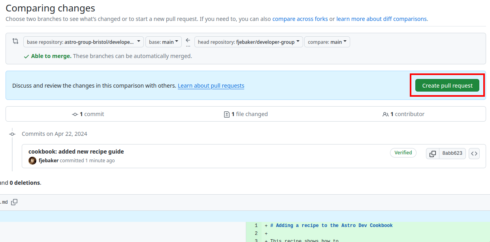

# Adding a recipe to the Astro Dev Cookbook

This recipe shows how to
- fork the developer group, and
- open a PR with a new recipe.

## Recipe

To open a Pull Request (PR), you first need to create a fork of the repository you want to contribute to. Navigate to the [Developer Group repository](https://github.com/astro-group-bristol/developer-group) and hit the fork button:



Confirm the name and location to fork to:



Next, you're going to want to get your fork on your local machine to make changes. To do this, clone your fork with

```bash
git clone git@github.com/YOUR_USERNAME/developer-group
```

Be sure to change `YOUR_USERNAME` to your appropriate GitHub username.

Then, copy and use the [template recipe](_template.md) and fill in all the details for your recipe:

```bash
cp cookbook/_template.md cookbook/SHORT-KEBAB-CASE-TITLE.md
```

If you have any additional assets that you want to include in your document, put them in the `.github/assets/` directory.

Once done, commit your recipe and its assets, and push to your fork

```bash
git add cookbook/SHORT-KEBAB-CASE-TITLE.md
git commit -m "cookbook: added new recipe"
git push origin main
```

Next, in your web browser, navigate to your fork and hit the "Contribute button" to open a pull request:






Be sure to give the PR a sensible title along the lines of `Cookbook: recipe for X`:


Someone will then review your pull request and likely discuss any changes that need to be made before it's good to merge! Thanks for making a recipe!
